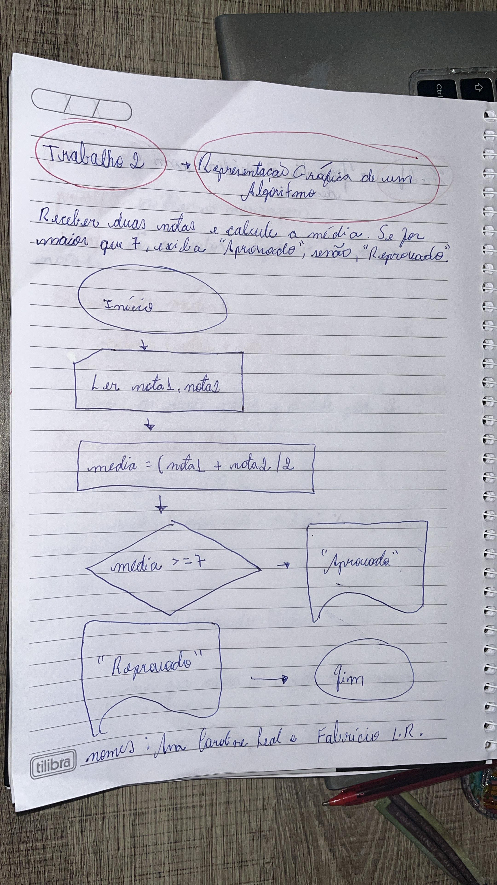

# Algoritmos em C

Exemplos práticos de alguns algoritmos estudados em sala - Matéria de Introdução a Programação de Computadores

## 🚀 Começando

### 📋 Pré-requisitos

```
gcc
make
```

## 📊 Fluxograma

Representação de um algoritmo de média por meio de um fluxograma



## ⚙️ Executando

Cálculo da média de 4 notas
```
make media
Digite a primeira nota: 3
Digite a segunda nota: 4
Digite a terceira nota: 5
Digite a quarta nota: 7
A média das notas é: 4.75
```

Cálculo da área de um círculo
```
make circle
Digite o valor do raio do círculo: 4
A área do círculo é: 50.27
```

Cálculo da área de um triângulo
```
make area
Digite o valor da base do triângulo: 4
Digite o valor da altura do triângulo: 5
A área do triângulo é: 20.00
```

Troca de valores entre 2 variáveis
```
make switch
Digite o valor de A: 3
Digite o valor de B: 2
Valores após a troca:
A = 2
B = 3
```

## 🛠️ Construído com

* [GCC](https://gcc.gnu.org/) - Compilador usado
* [Make](https://www.gnu.org/software/make/) - Automatizaçao da compilação

## ✒️ Autores

* **Fabrício** - *Trabalho Inicial* - [Fabrício](https://github.com/FabricioLR)
* **Ana Caroline** - *Trabalho Inicial* - [Ana Caroline](https://github.com/anac-roline)
